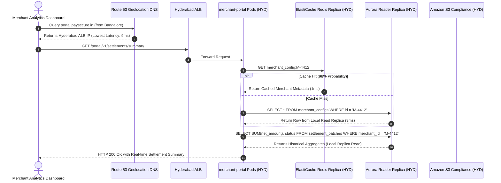
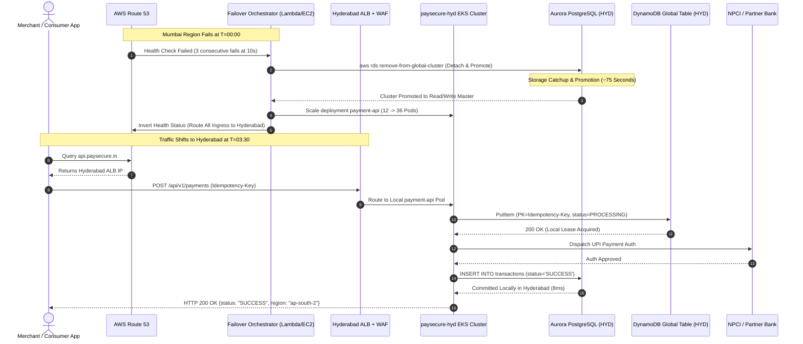
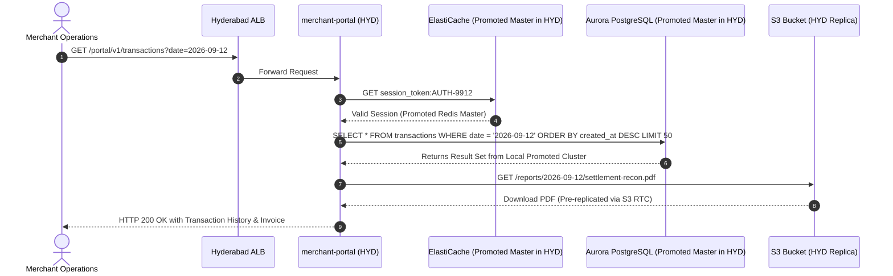
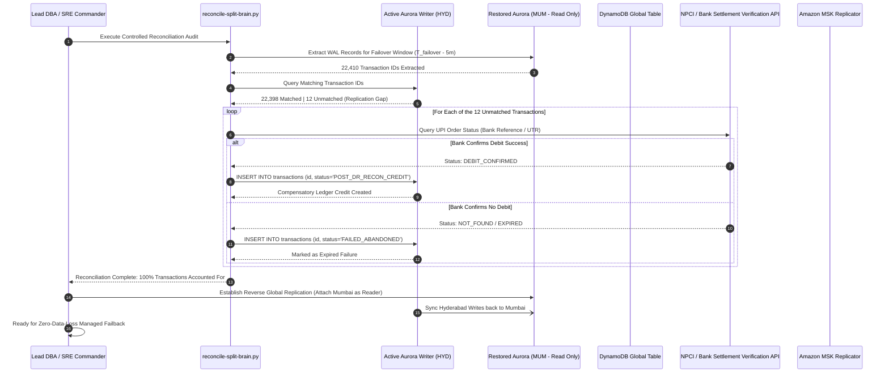

# PaySecure Gateway: Data Replication & Failover Sequence Diagrams

**Document ID**: PSG-DATA-002-SEQ  
**Syntax**: Mermaid Sequence Diagrams (Standard GitHub Markdown Compatible)  
**Classification**: Strictly Confidential - Distributed Systems Engineering  

---

## 1. Sequence Diagram 1: Normal Write-Path (Primary Region: Mumbai)

In standard production operations, 100% of transaction writes are processed by **AWS Mumbai (`ap-south-1`)**. The writer instance commits transactions locally to 6-way Multi-AZ storage, while storage blocks stream asynchronously to the Hyderabad reader replica over the AWS dedicated backbone.

```mermaid
sequenceDiagram
    autonumber
    actor Merchant as Merchant / Consumer App
    participant Route53 as AWS Route 53 (DNS)
    participant ALB as Mumbai ALB + WAF
    participant API as payment-api (Mumbai)
    participant Dynamo as DynamoDB Global Table (MUM)
    participant TxnProc as transaction-processor (MUM)
    participant CDE as tokenisation-service (CDE)
    participant Bank as NPCI / Card Network
    participant AuroraMum as Aurora PG Writer (MUM)
    participant AuroraHyd as Aurora PG Reader (HYD)
    participant MSK as Amazon MSK Kafka (MUM)

    Merchant->>Route53: DNS Query api.paysecure.in
    Route53-->>Merchant: Returns Mumbai ALB IP (TTL: 30s)
    Merchant->>ALB: POST /api/v1/payments (Idempotency-Key)
    ALB->>API: Route HTTP Request
    API->>Dynamo: PutItem (PK=Idempotency-Key, status=INITIATED)
    Dynamo-->>API: 200 OK (Lease Acquired in 8ms)
    
    API->>TxnProc: gRPC authorizePayment()
    TxnProc->>CDE: mTLS tokenizeCard() [Port 8443]
    CDE-->>TxnProc: Returns Encrypted Token (KMS mrk-mumbai)
    
    TxnProc->>Bank: Dispatch UPI / Card Auth Request
    Bank-->>TxnProc: Auth Approved (Bank Reference Number)
    
    TxnProc->>AuroraMum: BEGIN; INSERT INTO transactions; COMMIT;
    AuroraMum-->>TxnProc: Transaction Committed (10ms)
    
    par Async Storage Replication
        AuroraMum-)AuroraHyd: Storage-level WAL streaming (< 650ms lag)
    and Async Event Streaming
        TxnProc-)MSK: Publish Event (payment-events)
    and DynamoDB Cross-Region Sync
        Dynamo-)Dynamo: Bi-directional replication to HYD (< 800ms)
    end
    
    TxnProc-->>API: Payment Success Payload
    API-->>Merchant: HTTP 200 OK {status: "SUCCESS", txn_id: "TXN-998822"}
```

---

## 2. Sequence Diagram 2: Normal Read-Path (Cross-Region Read Scalability)

To minimize latency for merchant reporting and dashboard queries, read requests are served locally from reader replicas in the respective region, while writes flow exclusively to the primary writer.



---

## 3. Sequence Diagram 3: Failover Write-Path (Secondary Promoted: Hyderabad)

When Mumbai suffers a regional outage, Route 53 health checks detect failure within 30 seconds. The automated orchestrator detaches the Hyderabad Aurora cluster, scales EKS compute, and promotes Hyderabad to primary writer.



---

## 4. Sequence Diagram 4: Failover Read-Path (Secondary Serving 100% Ingress)

During full disaster recovery operation in Hyderabad, all reporting, merchant portals, reconciliation jobs, and customer transaction queries are served autonomously from `ap-south-2`.



---

## 5. Sequence Diagram 5: Data Reconciliation Post-Failback

Once Mumbai is fully recovered and certified stable, the automated reconciliation engine verifies data consistency between Mumbai's legacy storage logs and Hyderabad's promoted ledger before executing controlled failback.


