# PaySecure Gateway: Failover Timing Diagram & Latency Breakdown

**Document ID**: PSG-NET-002-TIMING  
**Target RTO**: < 5 Minutes (Design Verification: 210 Seconds / 3.5 Minutes)  
**Target RPO**: < 1 Minute (Design Verification: < 1.0 Second)  

---

## 1. Step-by-Step Failover Latency Timeline

This diagram illustrates the chronological progression of events following a catastrophic regional collapse of AWS Mumbai (`ap-south-1`) at $T = 00:00$, demonstrating how PaySecure Gateway achieves full operational recovery in Hyderabad (`ap-south-2`) at $T = 03:30$ ($210	ext{ seconds}$).

```mermaid
gantt
    title PaySecure Multi-Region Disaster Recovery Timeline (Total RTO: 3m 30s)
    dateFormat  ss
    axisFormat  %M:%S

    section Failure & Detection
    Mumbai Infrastructure Outage       :crit, active, 00, 30s
    Route 53 Fast Probes (3x fails)     :crit, 00, 30s
    P1 Alarm & Incident Cmd Paging      :active, 30, 30s

    section Decision & Detachment
    Incident Cmd Verifies AWS Health    :active, 60, 30s
    Trigger Aurora Secondary Detach     :crit, 90, 75s
    Aurora Promotes to Read/Write       :90, 75s

    section Compute & Cache Warmup
    EKS Rapid Autoscaling (12 -> 24 nodes): 90, 90s
    ElastiCache Global Datastore Promote  : 135, 30s

    section DNS & Traffic Shift
    Route 53 Inverts Primary Status     :crit, 165, 30s
    Global DNS TTL Eviction & Anycast   :165, 45s
    Traffic Ingress Shifts to Hyderabad :210, 15s

    section Verification & Cutover
    Synthetic Payment Test Validated    :active, 210, 15s
    100% Production Traffic Restored    :done, 210, 15s
```



---

## 2. Phase-by-Phase Component Durations

```
00:00                00:30                01:00                            02:15                  03:00         03:30
  │────────────────────│────────────────────│────────────────────────────────│──────────────────────│─────────────│
  ▼                    ▼                    ▼                                ▼                      ▼             ▼
[ Outage Occurs ]   [ Detection ]       [ Decision ]                     [ Aurora Detached ]    [ DNS Shift ] [ Fully Up ]
                    Route 53: 3x10s     IC Confirms Hard                 Storage Promoted       TTL 30s       100% Prod
                    Fast Probes Fail    Regional Outage                  Standby to Master      Propagated    Traffic
```

### Cumulative Latency Analysis
1. **Detection Window ($T=00:00 - 00:30$, Duration: 30s)**:
   - 8 global Route 53 health checking locations send HTTPS probes to `https://api-mum.paysecure.in/health/deep` every 10 seconds.
   - 3 consecutive failures confirm outage at $T = 00:30$.
2. **Decision & Confirmation Gate ($T=00:30 - 01:00$, Duration: 30s)**:
   - Incident Commander receives automated P1 page via PagerDuty.
   - Inspects AWS Health Dashboard and composite CloudWatch alarms; hits failover authorization button at $T = 01:00$.
3. **Database Detach & Promotion ($T=01:00 - 02:15$, Duration: 75s)**:
   - Automated script invokes `aws rds remove-from-global-cluster`.
   - Aurora storage nodes finish applying in-flight WAL blocks and transition cluster role to standalone primary writer in 75 seconds.
4. **DNS Propagation & Traffic Shift ($T=02:15 - 03:00$, Duration: 45s)**:
   - Route 53 marks primary as UNHEALTHY.
   - Anycast DNS resolvers evict cached 30-second records. Global traffic begins hitting Hyderabad ALB.
5. **Warm-Up Verification & Sign-Off ($T=03:00 - 03:30$, Duration: 30s)**:
   - Automated synthetic test transactions run against Hyderabad ALB.
   - Payment API returns HTTP 200 with transaction authorization in 180 ms.
   - **Total Real-World RTO: 3 Minutes 30 Seconds.**
