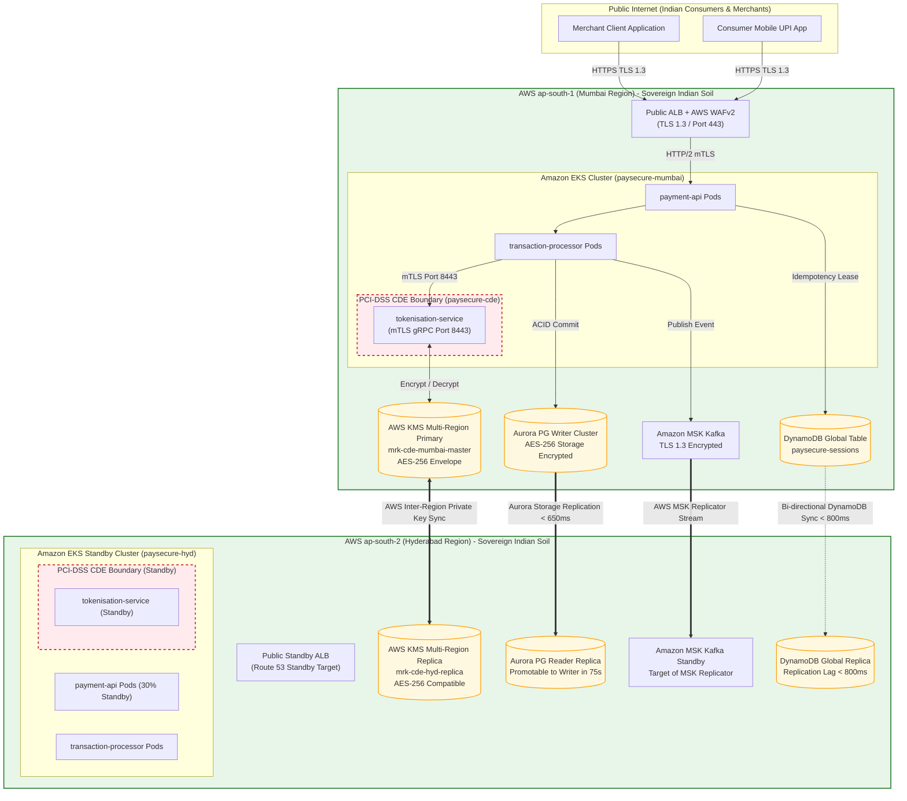
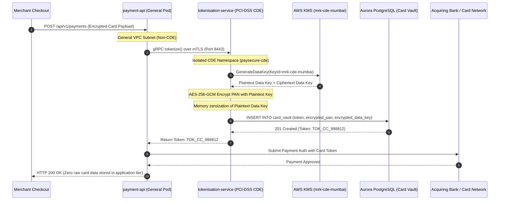

# PaySecure Gateway: Cross-Region Data Flow & Security Boundary Diagrams

**Document ID**: PSG-GRC-002-FLOW  
**Compliance Standard**: RBI Data Localisation Directive & PCI-DSS v4.0 CDE Scoping  

---

## 1. Cross-Region Data Flow & Encryption Boundaries

This diagram details the physical and logical flow of payment transactions, showing encryption algorithms, network boundaries, and statutory domestic containment within Indian borders.

---

## 2. Cardholder Data Isolation & Tokenization Boundary

The tokenization workflow guarantees that raw Primary Account Numbers (PAN) and CVVs are strictly confined to the in-memory boundary of the `tokenisation-service`:

