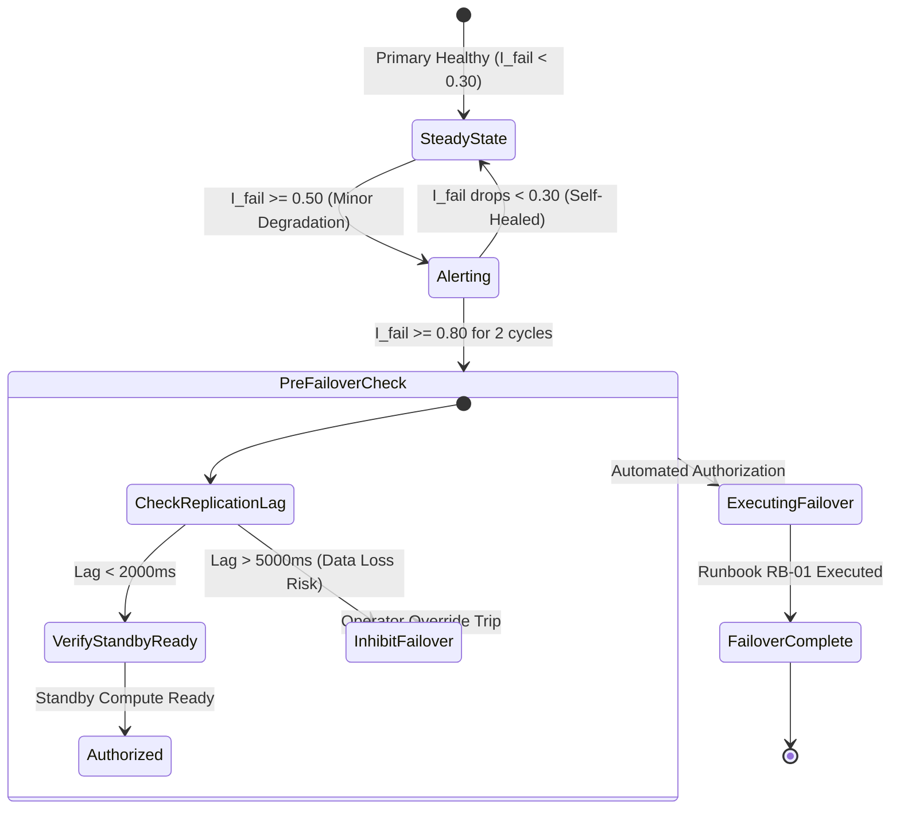

# PaySecure Gateway: Automated Multi-Signal Failover Decision Engine Specification

**Document ID**: PSG-SANDBOX-003-AFE  
**System**: Heuristic Failover Decision Engine (FDE)  
**Execution Runtime**: AWS Lambda (Multi-Region Active) with Step Functions Orchestration  

---

## 1. Executive Summary & Algorithmic Rationale

Relying solely on simple HTTP health checks for disaster recovery failover leads to **flapping and false-positive failovers** (e.g., executing a costly 3-minute regional database failover when a localized network blip recovers in 5 seconds).

The **Automated Failover Decision Engine (FDE)** aggregates six weighted telemetry signals into a real-time **Composite Failure Severity Index ($I_{	ext{fail}}$)**. Failover executes only when $I_{	ext{fail}} \ge 0.80$ for three consecutive evaluation cycles.

---

## 2. Signal Weighting & Evaluation Matrix

$$I_{	ext{fail}} = \sum_{i=1}^{6} (w_i \cdot s_i)$$

```
+---------------------------------------------------------------------------------------------------+
| Multi-Signal Decision Engine Weighted Telemetry Matrix                                            |
+---+---------------------------+--------+------------------------------------+---------------------+
| # | Signal Metric (s_i)       | Weight | Signal Condition / Threshold       | Subsystem Evaluated |
+---+---------------------------+--------+------------------------------------+---------------------+
| 1 | Route 53 Deep Probes      | 0.25   | HTTP 503 / Timeout on 3+ probes    | API Gateway Ingress |
| 2 | Aurora Writer Health      | 0.30   | Deadlock / Connection Pool = 0     | Core Transaction DB |
| 3 | Storage Replication Lag   | 0.15   | Replication Lag > 5,000 ms         | Cross-Region Sync   |
| 4 | AWS Personal Health API   | 0.15   | AWS confirms regional degradation  | Cloud Provider State|
| 5 | EKS Node Readiness Rate   | 0.10   | > 40% of worker nodes NotReady     | Kubernetes Compute  |
| 6 | DynamoDB Latency Spikes   | 0.05   | Idempotency Put latency > 500 ms   | Distributed Sessions|
+---+---------------------------+--------+------------------------------------+---------------------+
|   | TOTAL WEIGHTED INDEX      | 1.00   | Failover Trigger: I_fail >= 0.80   | Bounded Confidence  |
+---+---------------------------+--------+------------------------------------+---------------------+
```

---

## 3. Decision Engine State Machine & State Transitions



### Safety Interlocks & Override Mechanisms
1. **Flapping Suppression**: If a regional failover occurred within the trailing 60 minutes, automated failover is locked out, requiring manual two-key cryptographic authorization from the CTO and CRO.
2. **Data Loss Invalidation Gate**: If `AuroraGlobalDBReplicationLag` exceeds 5,000 ms at the time of failure, automated failover is suppressed to prevent uncontrolled transaction loss; the system drops into read-only authorization mode until an SRE reviews the ledger gap.
